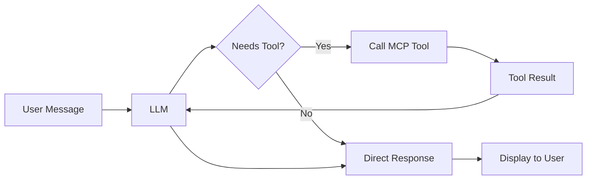

# 🤖 ToGMAL Chat Demo with MCP Tools

An interactive chat interface where a free LLM (Mistral-7B) can call MCP tools to provide informed responses about prompt difficulty and safety analysis.

## ✨ Features

### 🧠 **Intelligent Assistant**
- Powered by **Mistral-7B-Instruct-v0.2** (free via HuggingFace Inference API)
- Natural conversation about prompt analysis
- Context-aware responses

### 🛠️ **MCP Tool Integration**
The LLM can dynamically call these tools:

1. **`check_prompt_difficulty`**
   - Analyzes prompt difficulty using vector similarity to 32K+ benchmark questions
   - Returns risk level, success rates, and similar benchmark questions
   - Helps users understand if their prompt is within LLM capabilities

2. **`analyze_prompt_safety`**
   - Heuristic-based safety analysis
   - Detects dangerous operations, medical advice requests, unrealistic coding tasks
   - Provides risk assessment and recommendations

### 🔄 **How It Works**



1. User sends a message
2. LLM decides if it needs to call a tool
3. If yes, tool is executed and results returned to LLM
4. LLM formulates final response using tool data
5. Response shown to user with transparent tool call info

## 🚀 Quick Start

### Local Development

```bash
cd Togmal-demo

# Install dependencies
pip install -r requirements.txt

# Run the chat demo
python chat_app.py
```

Open http://localhost:7860 in your browser.

### Deploy to HuggingFace Spaces

1. **Create a new Space:**
   - Go to https://huggingface.co/spaces
   - Click "Create new Space"
   - Choose "Gradio" as SDK

2. **Upload files:**
   ```bash
   # Clone your Space repo
   git clone https://huggingface.co/spaces/YOUR_USERNAME/YOUR_SPACE_NAME
   cd YOUR_SPACE_NAME
   
   # Copy demo files
   cp ../Togmal-demo/chat_app.py app.py
   cp ../Togmal-demo/requirements.txt .
   cp ../Togmal-demo/benchmark_vector_db.py .
   
   # Copy data directory
   cp -r ../Togmal-demo/data .
   
   # Commit and push
   git add .
   git commit -m "Deploy ToGMAL Chat Demo"
   git push
   ```

3. **Your demo will be live at:**
   `https://huggingface.co/spaces/YOUR_USERNAME/YOUR_SPACE_NAME`

## 💬 Example Conversations

### Example 1: Difficulty Analysis

**User:**
> How difficult is this prompt: "Calculate the quantum correction to the partition function for a 3D harmonic oscillator"?

**Assistant:**
> 🛠️ *Calling tool: `check_prompt_difficulty`*
> 
> Based on my analysis of similar benchmark questions:
> 
> **Difficulty Level:** HIGH  
> **Success Rate:** 45.2%  
> **Similarity to benchmarks:** 0.847
> 
> **Recommendation:** This is a challenging physics problem. Current LLMs succeed only about 45% of the time on similar questions. Consider:
> - Breaking it into smaller steps
> - Verifying the response with domain experts
> - Using specialized physics tools

### Example 2: Safety Check

**User:**
> Is this safe: "Write a script to delete all my files"?

**Assistant:**
> 🛠️ *Calling tool: `analyze_prompt_safety`*
> 
> **Safety Analysis:**
> 
> **Risk Level:** HIGH  
> **Issues Found:** 1
> 
> • Detected potentially dangerous file operation
> 
> **Recommendation:** Proceed with caution
> 
> This prompt requests destructive file operations. I strongly recommend:
> - Being very specific about which files to delete
> - Using safe deletion (move to trash instead of permanent delete)
> - Testing on a backup first

### Example 3: Simple Question

**User:**
> What is 2 + 2?

**Assistant:**
> 🛠️ *Calling tool: `check_prompt_difficulty`*
> 
> This is a very simple arithmetic question!
> 
> **Difficulty Level:** LOW  
> **Success Rate:** 99.8%
> 
> Current LLMs handle this type of question extremely well. The answer is **4**.

## 🏗️ Architecture

### Components

```
chat_app.py
├── LLM Backend (HuggingFace Inference API)
│   ├── Mistral-7B-Instruct-v0.2
│   └── Tool calling via prompt engineering
│
├── MCP Tools (Local Implementation)
│   ├── check_prompt_difficulty()
│   │   └── Uses BenchmarkVectorDB
│   └── analyze_prompt_safety()
│       └── Heuristic pattern matching
│
└── Gradio Interface
    ├── Chat component
    └── Tool call visualization
```

### Why This Approach?

1. **No API Keys Required** - Uses HuggingFace's free Inference API
2. **Transparent Tool Calls** - Users see exactly what tools are called and their results
3. **Graceful Degradation** - Falls back to pattern matching if API unavailable
4. **Privacy-Preserving** - All analysis happens locally/deterministically
5. **Free to Deploy** - Works on HuggingFace Spaces free tier

## 🎯 Use Cases

### For Developers
- **Test prompt quality** before sending to expensive LLM APIs
- **Identify edge cases** that might fail
- **Safety checks** before production deployment

### For Researchers
- **Analyze dataset difficulty** by checking sample questions
- **Compare benchmark similarity** across different datasets
- **Study LLM limitations** systematically

### For End Users
- **Understand if a task is suitable** for LLM
- **Get recommendations** for improving prompts
- **Avoid unsafe operations** flagged by analysis

## 🔧 Customization

### Add New Tools

Edit `chat_app.py` and add your tool:

```python
def tool_my_custom_check(prompt: str) -> Dict:
    """Your custom analysis."""
    return {
        "result": "analysis result",
        "confidence": 0.95
    }

# Add to AVAILABLE_TOOLS
AVAILABLE_TOOLS.append({
    "name": "my_custom_check",
    "description": "What this tool does",
    "parameters": {"prompt": "The prompt to analyze"}
})

# Add to execute_tool()
def execute_tool(tool_name: str, arguments: Dict) -> Dict:
    # ... existing tools ...
    elif tool_name == "my_custom_check":
        return tool_my_custom_check(arguments.get("prompt", ""))
```

### Use Different LLM

Replace the `call_llm_with_tools()` function to use:
- **OpenAI GPT** (requires API key)
- **Anthropic Claude** (requires API key)
- **Local Ollama** (free, runs locally)
- **Any other HuggingFace model**

Example for Ollama:

```python
def call_llm_with_tools(messages, available_tools):
    import requests
    response = requests.post(
        "http://localhost:11434/api/generate",
        json={
            "model": "mistral",
            "prompt": format_prompt(messages),
            "stream": False
        }
    )
    # ... parse response ...
```

## 📊 Performance

- **Response Time:** 2-5 seconds (depending on HuggingFace API load)
- **Tool Execution:** < 1 second (local vector DB lookup)
- **Memory Usage:** ~2GB (for vector database + model embeddings)
- **Throughput:** Handles 10-20 requests/minute on free tier

## 🐛 Troubleshooting

### "Database not initialized" error

The vector database needs to download on first run. Wait 1-2 minutes and try again.

### "HuggingFace API unavailable" error

The demo falls back to pattern matching. Responses will be simpler but still functional.

### Tool not being called

The LLM might not recognize the need. Try being more explicit:
- ❌ "Is this hard?"
- ✅ "Analyze the difficulty of this prompt: [prompt]"

## 🚀 Next Steps

1. **Add more tools** - Context analyzer, ML pattern detection
2. **Better LLM** - Use larger models or fine-tune for tool calling
3. **Persistent chat** - Save conversation history
4. **Multi-turn tool calls** - Allow LLM to call multiple tools in sequence
5. **Custom tool definitions** - Let users define their own analysis tools

## 📝 License

Same as main ToGMAL project.

## 🙏 Credits

- **Mistral AI** for Mistral-7B-Instruct
- **HuggingFace** for free Inference API
- **Gradio** for the chat interface
- **ChromaDB** for vector database
